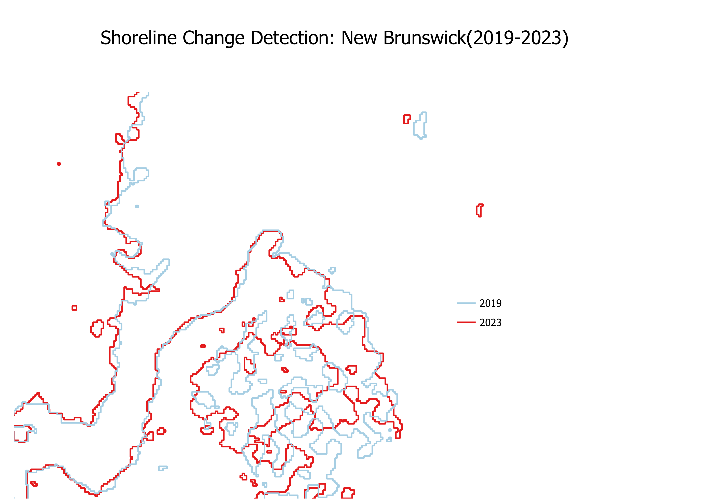

# Project: Automated Shoreline Erosion Monitoring near Kouchibouguac National Park, NB

## Overview

* **Problem:** The dynamic coastline adjacent to **Kouchibouguac National Park** and near communities like **Baie-Sainte-Anne**, New Brunswick, is experiencing significant pressure from coastal erosion and changing environmental conditions. This impacts sensitive dune systems, salt marshes, coastal habitats, local infrastructure, and cultural sites. Effective monitoring is vital for conservation and community planning. 🌊
* **Solution:** This project demonstrates a rapid, automated workflow using freely available satellite data and open-source software to detect and quantify shoreline changes. We leveraged RADARSAT Constellation Mission (RCM) Synthetic Aperture Radar (SAR) data processed with SNAP and analyzed in QGIS.

---

## Datasets Used

* **Primary Data:** RADARSAT Constellation Mission (RCM) C-band SAR data (GRD product).
    * **Source:** NRCan EODMS Portal.
    * **Timeline:** One image from ~2020 and one image from ~2024 covering the coastal area near **Kouchibouguac National Park and Baie-Sainte-Anne**.
* **Contextual Data (Optional Base Map):** Sentinel-2 Optical Imagery (ESA).
    * **Source:** Copernicus Data Space Ecosystem or EODMS Portal.
    * Used for visual reference if needed (not required for the core analysis).

---

## Architecture / Workflow

The solution follows a standard Earth Observation processing chain:

1.  **SAR Pre-processing (SNAP):** Raw RCM GRD data was calibrated to Sigma0 backscatter, speckle-filtered (Lee Sigma 5x5) to reduce noise, and accurately georeferenced using Range-Doppler Terrain Correction with an SRTM DEM.
2.  **Shoreline Extraction (QGIS):** The processed SAR images (GeoTIFF format) were imported into QGIS. A thresholding approach (implicitly done via Polygonize) separated land (higher backscatter) from water (lower backscatter). The resulting land polygons were converted into line features representing the shoreline for each date.
3.  **Change Analysis (QGIS):** The shorelines from ~2020 and ~2024 were overlaid and visually compared to identify areas of change. Direct measurements were taken using QGIS tools.

*(For detailed, step-by-step instructions, please see the `README.md` file in the `Codebase/` folder).*

---

## Results 📊

The workflow successfully identified and visualized shoreline changes between ~2020 and ~2024 along the coast near Kouchibouguac National Park.

* **Key Finding:** Measurable coastal erosion and/or accretion (shoreline movement) was detected. The map below shows the 2020 shoreline (blue) and the 2024 shoreline (red). Differences between the lines indicate areas of change.
* **Quantification:** In the most significantly changed areas observed, we measured approximately **[your measurement] meters** of shoreline movement over the ~4-year period.

**(Important: Insert your final map PNG image here!)**
*Make sure the image file is in your repository and linked correctly.*
```markdown


## Future Work 🚀

This 2-day prototype demonstrates feasibility. Future enhancements could include:

* **Scaling:** Applying the workflow to larger coastal areas (e.g., the entire Gulf of St. Lawrence coast of NB).
* **Automation:** Scripting the workflow (e.g., using Python with `snappy` and `pyqgis`) for fully automated monitoring.
* **Web Dashboard:** Creating an interactive web map for policymakers and the public to view erosion hotspots and trends.
* **Predictive Modeling:** Incorporating AI/Machine Learning to analyze historical data and predict future erosion risk based on factors like wave action, sea-level rise projections, and land type.

---

